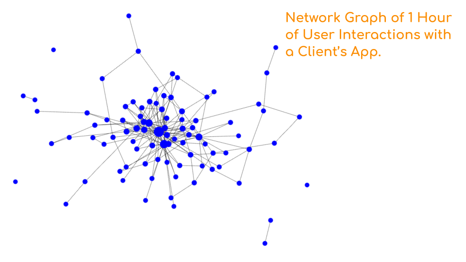

# Panomaly
"Understanding the network of user interaction anomalies"
### A Consulting Project for [Lazy Lantern](https://www.lazylantern.com)

## Donald W. Hoard, Ph.D.   
Data Science Fellow    
[Insight Data Science](https://insightfellows.com/data-science)   
Los Angeles - Jan 2020


Panomaly is an algorithm that uses a custom hybrid network graph-Bayesian probability model to identify linked anomalies in website/app user interactions. I built Panomaly in just 3 weeks during early January 2020 as a project for my [Insight Data Science](https://insightfellows.com/data-science).

Panomaly is intended as an add-on to [Lazy Lantern's](https://www.lazylantern.com) existing anomaly detection algorithm.
Panomaly is fully integrated with the raw event and processed anomaly databases, and can be quickly run at the end of every hour (following anomaly detection for that hour) to surface linked anomalies.
Panomaly produces a table of linked anomalies containing a single evaluation metric (Qpan) along with a verdict (True or False) indicating whether or not to surface the linkage to the client dashboard.
The verdict function (as well as the calculation of Qpan) can be easily modified as desired (or even set up to produce different results on an app-by-app basis).

### Nomenclature

* **event** = a single (raw) user action

* **metric** = a time series of the same event aggregated over all users

* **anomaly** = a metric flagged by the forecasting algorithm as outside the confidence interval for the current time interval

### Output
There are two dataframes created as output by Panomaly, which can be used as input to further code for surfacing the linked anomalies:

* ```pan_la_df```: The Linked Anomalies dataframe contains information about linked pairs of anomalies, including the individual and combined metrics used to evaluate the relative "strength" or "importance" of their linkage. For example:

| _ | N1 | id_anom1 | id_metric1 | metric_name1 | N2 | id_anom2 | id_metric2 | metric_name2 | PbProb | PbNab | PfProb | Gmod1 | Gdeg1 | Gbtw1 | Gevc1 | Gavg1 | Gmod2 | Gdeg2 | Gbtw2 | Gevc2 | Gavg2 | pan_class | Qp | Qg | Qpan | Qcrit | Verdict |
| --- | --- | --- | --- | --- | --- | --- | --- | --- | --- | --- | --- | --- | --- | --- | --- | --- | --- | --- | --- | --- | --- | --- | --- | --- | --- | --- | --- |
| 0 | 79 | 19021 | 4473 | Side Nav Clicked | 79 | 19021 | 4473 | Side Nav Clicked | 0.067568 | 5 | 0.004850 | 0 | 0.397059 | 0.264518 | 0.343285 | 0.334954 | 0 | 0.397059 | 0.264518 | 0.343285 | 0.334954 | 4 | 0.067741 | 0.473697 | 0.478516 | 0.0 | True |
| 1 | 79 | 19021 | 4473 | Side Nav Clicked | 149 | 19022 | 4470 | App Timing Metric | 0.158532 | 18 | 0.017459 | 0 | 0.397059 | 0.264518 | 0.343285 | 0.334954 | 2 | 0.514706 | 0.396241 | 0.462934 | 0.457960 | 2 | 0.159490 | -1.000000 | 0.105998 | 0.1 | True |
| 2 | 149 | 19022 | 4470 | App Timing Metric | 73 | 19024 | 4471 | First Contentful Paint | 0.583351 | 48 | 0.046557 | 2 | 0.514706 | 0.396241 | 0.462934 | 0.457960 | 2 | 0.176471 | 0.016147 | 0.203546 | 0.132054 | 3 | 0.585206 | 0.476620 | 0.754740 | 0.1 | True |
| 3 | 79 | 19021 | 4473 | Side Nav Clicked | 43 | 19023 | 4468 | First Paint | 0.000000 | 0 | 0.000000 | 0 | 0.397059 | 0.264518 | 0.343285 | 0.334954 | 2 | 0.147059 | 0.007143 | 0.191328 | 0.115177 | -1 | 0.000000 | 0.354203 | 0.000000 | 1.0 | False |
| 4 | 43 | 19023 | 4468 | First Paint | 149 | 19022 | 4470 | App Timing Metric | 0.221624 | 17 | 0.016489 | 2 | 0.147059 | 0.007143 | 0.191328 | 0.115177 | 2 | 0.514706 | 0.396241 | 0.462934 | 0.457960 | 3 | 0.222237 | 0.472222 | 0.521903 | 0.1 | True |
| ... | ... | ... | ... | ... | ... | ... | ... | ... | ... | ... | ... | ... | ... | ... | ... | ... | ... | ... | ... | ... | ... | ... | ... | ... | ... | ... | ... |


* ```pan_master_report_df```: The Master Report dataframe contains a list of grouped anomalies in different classes (described below) that have received a True verdict (surface to client dashboard). For example:

| _ | id_anom | id_metric | metric_name | pan_class | pan_class_tag |
| --- | --- | --- | --- | --- | --- |
| 0 | [19021] | [4473] | [Side Nav Clicked] | 4 | Pb & G (self) |
| 1 | [19022] | [4470] | [App Timing Metric] | 4 | Pb & G (self) |
| 3 | [19022, 19023, 19024] | [4470, 4468, 4471] | [App Timing Metric, First Paint, First Contentful Paint] | 3 | Pb & G |
| 4 | [19021, 19022] | [4473, 4470] | [Side Nav Clicked, App Timing Metric] | 2 | Pb only |


### About
For reference, this code version is ```panomaly-v14.0-offline```. This is the offline demonstration version of Panomaly that uses a subset of anonymized sample data rather than connecting on-the-fly to [Lazy Lantern's](https://www.lazylantern.com) proprietary databases.


### License
Permission to view and try the demo version of this code for personal or educational use is granted; however, copyright (including rights to modify and/or distribute) are solely held by the author (D. W. Hoard), with an unlimited license granted to Lazy Lantern, in perpetuity, to use, modify, and/or distribute the code.

### Project Demonstration Slides

I initially approached this as a time series problem; however, because users can perform similar actions at different times or with different cadences, I realized that it would be better to set it up as a network problem, where a user’s specific interactions with an app can be represented as a series of transitions between generic events.
</br>
</br>


The aggregate of all user’s interactions with an app during a one hour interval forms the event network.
</br>
</br>


I identify regions within the network where events have especially dense connections with each other - these events are “important” to each other.
</br>
</br>


When anomalous events are found in one of these regions, I infer that they are related. The strength of the relationship can be quantified by comparing various graph metrics, such as eigencentrality, which measures the importance of an event based on how many other highly linked events it connects to.
</br>
</br>


At the same time, I applied Bayesian probability analysis to the network. This lets me calculate the probability that users will trigger an event based on knowing the prior step in their event paths. When there is a high probability of two anomalous events occurring in sequence, I infer that they are related.
</br>
</br>


Finally, I combine several standard metrics produced by the graph and probability analyses into a single metric.
</br>
</br>


I validated my algorithm using event inference, by manually inspecting 30 one-hour segments of user interaction data containing a total of 164 anomalies. As I mentioned, the algorithm is designed to be generic but for some of the client apps, the developers have provided text tags that are descriptive enough that I can infer which events are related, either because they proceed in a logical sequence, or they are similar actions. Overall, more than 60% of the linked anomalies agree with the inference from their event descriptions.
</br>
</br>


I want to finish by showing an example of a network constructed using real data from an app from one of Lazy Lantern’s clients rather than the schematic network I’ve been showing. This is the basic network.
</br>
</br>


Now I’ve color-coded the modularity classes of related events.
</br>
</br>


And flagged the anomalous events.
</br>
</br>


And here are several linked anomalies found by my algorithm, along with their final metric scores. As a reminder, my model treats the events as generic - they’re just labeled with numbers without prior information about the function of any event.
</br>
</br>


But by applying my validation method, I can see that these linked anomalies share event inference - they’re all actions related to the app’s side navigation menu. With Panomaly, Lazy Lantern can now simplify their clients’ analytics dashboards by reducing the average number of anomaly alerts by 40%, and providing more meaningful insights into user interactions.
